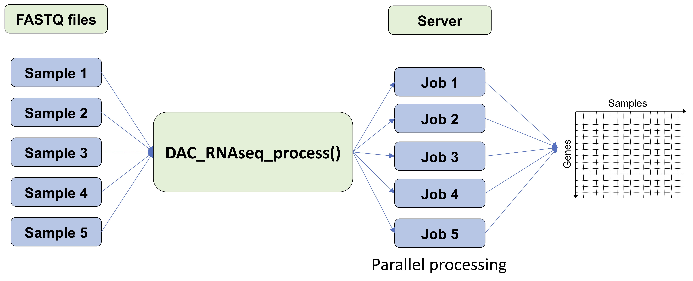

# Dartmouth CQB RNA-seq analysis pipeline

## Introduction 
The pipeline is designed to provide efficient pre-processing and quality control of bulk RNA-sequencing (RNA-seq) data on high performance computing clusters (HPCs) leverging the Torque/PBS scheduler, and has been made available by the *Data Analytics Core (DAC)* of the *Center for Quantitative Biology (CQB)*, located at Dartmouth College. Both single- and paired-end datasets are supported, in addition to both library preparation methods interrogating full-length transcripts as well as 3'-end profiling methods. The pipeline has been built and tested using human and mouse data sets. Required software can be installed using Conda with the enrionment file (environment.yml) located in *Dartmouth-Data-Analytics-Core/DAC-rnaseq-pipeline/*. are managed using a Conda environment currently available on the Dartmouth HPC infrastructure (the Dartmouth Discovery cluster) but will be made more widely accessible in the near future. 


## Pipeline summary:
The major steps implmented in the pipeline include: 

- FASTQ quality control assesment using [*FASTQC*](https://www.bioinformatics.babraham.ac.uk/projects/fastqc/)
- Read trimming for Poly-A tails, specified adapters, and read quality using [*cutadapt*](https://cutadapt.readthedocs.io/en/stable/)
- Alignment using [*STAR*](https://github.com/alexdobin/STAR)
- Quantification with [*HTSeq-count*](https://htseq.readthedocs.io/en/release_0.11.1/count.html) or [*RSEM*](https://deweylab.github.io/RSEM/)

All of these tools have been installed in the [conda environment](https://docs.conda.io/en/latest/). As input, the pipeline takes raw data in FASTQ format, and produces quantified read counts (using *HTSeq-Count* or *RSEM*) as well as a detailed quality control report (including pre- and post-alignment QC metrics) for all processed samples. Quality control reports are aggregated into HTML files using *MultiQC*. 

R-code used to perform downstream exploratory data analysis and gene-level differential expression are also provided, however are currently detatched from the preprocessing and quality control steps and must be run separately. These scripts will be incorporated into the pipeline in the near future. 

## Implementation
The pipeline uses R-scripts to generate and submit jobs to the scheduler, and requires several variables to be defined by the user when running the pipeline: 

* **Lab** - The name of the lab, or relevant project name (used for file naming)
* **FastqRaw** - The absolute path to raw FASTQ files.
* **SamNames** - A vector of sample names (e.g. SamName <- c("SamName1", "SamName2", etc.)) that make up the prefixes of FASTQ file (e.g. 'SamName1' for 'SamName1_R1_001.fastq.gz'.
* **SeqMethod** - Either "singleEnd" or "pairedEnd" for assays profiling full transcripts or "3Prime" for 3'-end profiling assays. 
* **AlignInd** - Absolute path to the STAR index to be used as the reference genome. 
* **AlignRef** - Absolute path to the genome annotation (.gtffile ) to be used during alignment (to determine splice-site coordinates)
This is the reference that you would like to use during the alignment step, please give an absolute path (*.gtf).
* **PicardInt** - Absolute path to coordinates of ribosomal RNA sequences in reference genome, in [interval-list format](https://gatk.broadinstitute.org/hc/en-us/articles/360035531852-Intervals-and-interval-lists)
* **PicardRef** - Absolute path to genome annotation in [RefFlat format](https://gatk.broadinstitute.org/hc/en-us/articles/360040509431-CollectRnaSeqMetrics-Picard-)
* **QuantRef** - Absolute path to genome annotation file (.gtf) of [*HTSeq-count*](https://htseq.readthedocs.io/en/release_0.11.1/count.html) or [*RSEM*](https://deweylab.github.io/RSEM/)
* **CondaEnv**- This is the environment that includes all of the dependencies needed to run this pipeline, the yml file to create this environment is included in this directory (environment.yml).
* **meanLength**- The average fragment length for single end reads. Default setting is 313 based on the experience of DAC. This only works when SeqMethod is "singleEnd". 
* **sdLength** - The stander devication fragment length for single end reads. Default setting is 91 based on the experience of DAC. This only works when SeqMethod is "singleEnd".
* **OutputFolder** - Absolute path to directory for pipeline outputs. Before running the pipeline, you should create the following outputs in this directory:
tmp/
fastqc/
trim/
alignment/
rawcounts/

### Example of human paired end RNA-seq data 
#### R script
```{r}
#load the functions
source("pipeline.R"
#Preparation for parameters 
whoseData <- "Example"
mySeq <- "pairedEnd"
myRaw <- "path to folder of all the raw fastq files"
myOut <- "path to folder of outputs"
myConda <- "path to the conda environment"
#--
StarInd <- "path_to/STAR/hg38_index"
StarRef <- "path_to//Homo_sapiens.GRCh38.97.gtf"
PicardRef <- "path_to/Homo_sapiens.GRCh38.97.refFlat.txt"
PicardInt <- "path_to//Homo_sapiens.GRCh38.97.rRNA.interval_list"
RsemRef <- "path_to/RSEMref"
#--
mySams <- c("sample 1", "sample 2", "sample 3", "sample 4", "sample 5")
#--
# Clean the data in the folders in the OutputFolder if you want the same folders to keep outputs. If you name a new folder for outputs, Skip this step. 
cleanFolders(myOut)

DAC_RNAseq_process(Lab = whoseData, FastqRaw = myRaw, SamNames = mySams, SeqMethod = mySeq, AlignInd = StarInd, AlignRef = StarRef, 
		PicardInt = PicardInt, PicardRef = PicardRef, QuantRef = RsemRef, CondaEnv = myConda, meanLength = 313, sdLength = 91, OutputFolder = myOut)
```
#### Bash script
After running the DAC_RNAseq_process() function, jobs will be generated in the tmp/ folder. Then, using the following commands to submit your jobs to the server. If you are a Dartmouth user and have [discovery account](https://rc.dartmouth.edu/index.php/discovery-overview/), the jobs will go to the server automatically. If you are using other servers, you can revise the code to match your own servers.
```{shell}
cd path_to/tmp/
bash submit.sp
```


### General implementation notes: 
* This pipeline only currently accepts **stranded** sequencing libraries for processing. If your data was generated using an unstranded RNA-seq library preparation protocol, you will need to change options specified in the read-count quantification step using htseq-count. We hope to address this limitation in future versions of the pipeline. 

> **Contact & questions:** 
> Please address questions to *DataAnalyticsCore@groups.dartmouth.edu* or generate a issue in the GitHub repository. 

> **This pipeline was created with funds from the COBRE grant **1P20GM130454**. 
> If you use the pipeline in your own work, please acknowledge the pipeline by citing the grant number in your manuscript.**

